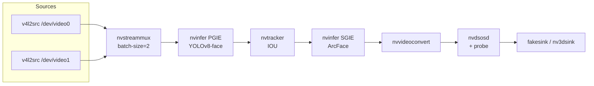
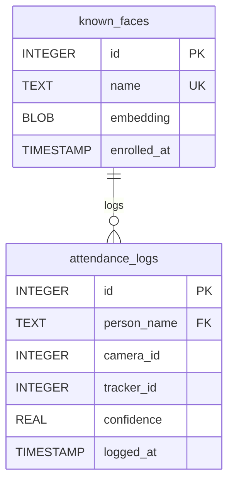

# Edge AI Face Recognition — Architecture Walkthrough

## Pipeline Topology



## Files Delivered

| File | Purpose |
|------|---------|
| [nano_dual_stream.py](file:///c:/Users/ADITYA/Desktop/MITS/4thsem/Face-Detection-Edge/nano_dual_stream.py) | Main GStreamer/DeepStream pipeline |
| [init_db.py](file:///c:/Users/ADITYA/Desktop/MITS/4thsem/Face-Detection-Edge/init_db.py) | SQLite schema + enrollment CLI |
| [config_infer_primary_yolo.txt](file:///c:/Users/ADITYA/Desktop/MITS/4thsem/Face-Detection-Edge/config_infer_primary_yolo.txt) | PGIE config for YOLOv8-face |
| [config_infer_secondary_arcface.txt](file:///c:/Users/ADITYA/Desktop/MITS/4thsem/Face-Detection-Edge/config_infer_secondary_arcface.txt) | SGIE config for ArcFace |
| [tracker_config.yml](file:///c:/Users/ADITYA/Desktop/MITS/4thsem/Face-Detection-Edge/tracker_config.yml) | IOU tracker parameters |
| [labels_yolo.txt](file:///c:/Users/ADITYA/Desktop/MITS/4thsem/Face-Detection-Edge/labels_yolo.txt) | Single-class label (face) |

---

## Data Flow Explained

### Stage 1 — Source Acquisition
Two `v4l2src` elements capture 640×480 @ 30fps from USB webcams. Each passes through `videoconvert → nvvideoconvert` to move frames into NVMM (GPU) memory as NV12 surfaces. For RTSP, replace the URI in `INPUT_SOURCES` with `rtsp://...` and the code auto-switches to `uridecodebin`.

### Stage 2 — Stream Muxing
`nvstreammux` batches frames from both sources into a single `NvDsBatchMeta` with `batch-size=2`. The `batched-push-timeout` of 40ms ensures the pipeline doesn't stall waiting for a slow camera.

### Stage 3 — PGIE (YOLOv8-face)
The primary `nvinfer` runs the ONNX model in FP16 mode. It detects faces as class 0 with NMS IOU threshold 0.45 and confidence threshold 0.25. Each detection becomes an `NvDsObjectMeta` attached to the frame.

### Stage 4 — Tracker (IOU)
`nvtracker` assigns persistent `object_id` values to each detected face. The `probationAge=3` setting requires a face to appear in 3 consecutive frames before getting a stable ID — this filters flickering false positives. `maxShadowTrackingAge=30` maintains the ID for ~1 second during brief occlusions.

> [!IMPORTANT]
> The tracker is the key to preventing duplicate database writes. Without it, the same face would generate a new attendance log every single frame.

### Stage 5 — SGIE (ArcFace)
The secondary `nvinfer` crops each tracked face ROI, resizes it to ArcFace's input resolution, and runs the recognition model. It outputs a 512-dimensional embedding as a raw tensor blob attached to the object's `obj_user_meta_list`.

### Stage 6 — Probe (The Brain)

The `osd_sink_pad_buffer_probe` is where all intelligence lives:

1. **Iterate** through each frame in the batch → each object in the frame
2. **Extract** the SGIE tensor by walking `obj_user_meta_list`, filtering for `NVDSINFER_TENSOR_OUTPUT_META` with `unique_id == 2`
3. **Cast** the raw buffer pointer to a `ctypes.c_float` array and copy into a numpy array
4. **Match** via cosine similarity against the L2-normalized embeddings cached from SQLite
5. **Gate** by tracker ID + 60-second cooldown to prevent duplicate logs
6. **Push** matched `(name, camera_id, tracker_id, confidence)` tuples to a thread-safe `Queue`

### Stage 7 — Database Writer Thread

A daemon thread pulls from the `Queue` and writes to `attendance_logs`. This isolates SQLite I/O from the GStreamer streaming thread, preventing frame drops due to disk latency.

---

## Database Schema



---

## Deployment Steps on Jetson Nano

```bash
# 1. Initialize the database
python3 init_db.py create

# 2. Enroll known faces (from pre-extracted .npy embeddings)
python3 init_db.py enroll "Alice" embeddings/alice.npy
python3 init_db.py enroll "Bob" embeddings/bob.npy

# 3. Place ONNX models
mkdir -p models/
# Copy yolov8n-face.onnx and arcface_r100.onnx into models/

# 4. Run the pipeline
python3 nano_dual_stream.py
```

> [!NOTE]
> The first run will take 5–10 minutes as TensorRT builds the `.engine` files for the Jetson Nano's Maxwell GPU. Subsequent runs start in seconds.

## Key Design Decisions

| Decision | Rationale |
|----------|-----------|
| FP16 inference (`network-mode=2`) | Maxwell GPU on Nano has FP16 tensor cores — 2× throughput vs FP32 |
| SGIE `batch-size=16` | Multiple faces across 2 streams can be batched in a single inference pass |
| Cooldown per `(source_id, tracker_id)` | Prevents logging the same person 30× per second while they're on camera |
| L2-normalize on both enroll and query | Makes cosine similarity equivalent to a simple dot product — faster matching |
| `process-mode=2` on OSD | GPU-accelerated drawing, no CPU overhead |
| `network-type=1` for SGIE | Classifier mode preserves raw tensor output (the embedding), unlike detector mode which would try to parse bounding boxes |
